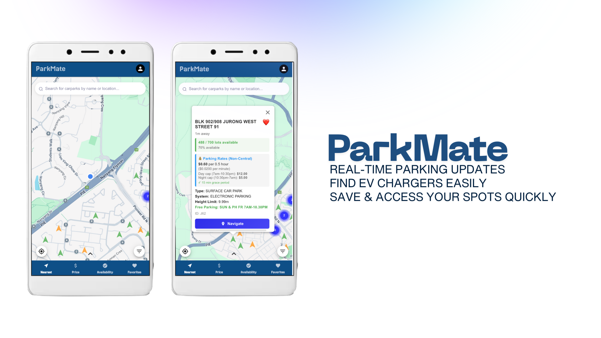

# SC2006 - Software Engineering Project (NTU)

## Team Glitch - ParkMate Application

This repository contains the lab deliverables and the main ParkMate parking application project.

[](LICENSE)
[](https://nodejs.org/)
[](https://reactjs.org/)
[](https://www.typescriptlang.org/)

**ParkMate** is a comprehensive parking management system designed for Singapore, helping users find, reserve, and manage parking spaces efficiently. Built as part of the SC2006 Software Engineering course at Nanyang Technological University.

---

## 🎯 Project Overview

ParkMate addresses the common challenge of finding available parking spaces in Singapore's busy urban environment. The application provides:

- **Real-time Availability**: Live carpark availability data from Singapore's data.gov.sg API
- **Smart Search**: Location-based search with filters for price, distance, and amenities
- **User Profiles**: Personalized experience with favorites and search history
- **Cost Calculator**: Estimate parking costs before arrival
- **Responsive Design**: Works seamlessly on desktop and mobile devices

---

## 📁 Repository Structure

```
└── parkmate-app/                   # 🚀 Main Application (Full-stack)
    ├── backend/                    # Node.js + Express + TypeScript
    │   ├── src/
    │   │   ├── modules/           # Feature modules (auth, carpark, favorites, etc.)
    │   │   ├── config/            # Database, Redis, environment configs
    │   │   ├── database/          # SQL schemas and migrations
    │   │   ├── integrations/      # External API integrations
    │   │   └── shared/            # Middleware and utilities
    │   ├── Dockerfile
    │   └── package.json
    │
    ├── frontend/                   # React + Vite + Material-UI
    │   ├── src/
    │   │   ├── features/          # Feature-based modules
    │   │   ├── pages/             # Page components
    │   │   ├── services/          # API clients
    │   │   └── store/             # Redux state management
    │   ├── Dockerfile
    │   └── package.json
    │
    ├── docker-compose.yml          # Docker orchestration
    ├── README.md                   # 📖 Complete project documentation
    ├── SETUP_GUIDE.md              # 🛠️ Step-by-step setup instructions
    ├── DOCKER_README.md            # 🐳 Docker deployment guide
    └── CONTRIBUTING.md             # 👥 Team contribution guidelines
```

---

## 🚀 Quick Start

### Option 1: Docker (Recommended - Fastest Setup)

```bash
# Navigate to the application directory
cd parkmate-app

# Start all services with Docker
docker-compose up -d

# Import carpark data
./docker-import-carparks.sh

# Access the application
# Frontend: http://localhost:3000
# Backend: http://localhost:5001
# API Docs: http://localhost:5001/api-docs
```

### Option 2: Manual Setup

```bash
# Navigate to the application directory
cd parkmate-app

# Follow the detailed setup guide
# See SETUP_GUIDE.md for complete instructions
```

**📖 For detailed setup instructions, see:** [`parkmate-app/SETUP_GUIDE.md`](./parkmate-app/SETUP_GUIDE.md)

---

## 🛠️ Technology Stack

### Frontend
- **Framework**: React 18 with TypeScript
- **Build Tool**: Vite 4
- **UI Library**: Material-UI (MUI) v5
- **State Management**: Redux Toolkit
- **Maps**: Google Maps JavaScript API
- **HTTP Client**: Axios
- **Routing**: React Router v6

### Backend
- **Runtime**: Node.js 18+
- **Framework**: Express.js
- **Language**: TypeScript
- **Database**: PostgreSQL 15
- **Caching**: Redis 7
- **Authentication**: JWT (JSON Web Tokens)
- **API Documentation**: Swagger/OpenAPI
- **Validation**: Zod
- **ORM**: Raw SQL queries with pg library

### DevOps & Infrastructure
- **Containerization**: Docker & Docker Compose
- **Version Control**: Git & GitHub
- **CI/CD**: GitHub Actions (planned)
- **Environment Management**: dotenv

### External APIs
- **Singapore Carpark Availability**: data.gov.sg API
- **Maps & Geocoding**: Google Maps API

---

## 📚 Documentation

Comprehensive documentation is available in the [`parkmate-app/`](./parkmate-app) directory:

| Document | Description |
|----------|-------------|
| [**README.md**](./parkmate-app/README.md) | 📖 Complete project documentation, architecture, and API reference |
| [**SETUP_GUIDE.md**](./parkmate-app/SETUP_GUIDE.md) | 🛠️ Step-by-step local development setup (10-15 minutes) |
| [**DOCKER_README.md**](./parkmate-app/DOCKER_README.md) | 🐳 Docker deployment guide and troubleshooting |
---

## ✨ Key Features

### Implemented Features ✅
- User authentication (register, login, logout, JWT refresh)
- Real-time carpark availability from Singapore data.gov.sg
- Location-based carpark search
- Interactive map interface with Google Maps
- Carpark details and information display
- Favorites management
- Search history tracking
- User profile management
- Responsive design for mobile and desktop
- API documentation with Swagger
- Docker deployment support

### Planned Features 🔮
- Parking cost calculator
- Advanced filtering (price range, amenities, distance)
- Real-time notifications for availability changes
- Parking reservations
- Payment integration
- Navigation to carpark
- Reviews and ratings

---

## 👥 Team Glitch - SC2006 Software Engineering

This project is developed by Team Glitch as part of the SC2006 Software Engineering course at Nanyang Technological University.

### Team Members
- Harshil Gupta ([@rishu1903](https://github.com/rishu1903))
- Goh Jin Long Abdillah ([@gohabdillah](https://github.com/gohabdillah))
- Guan Yibin ([@Zerius7733](https://github.com/Zerius7733))
- Kumar Preetham ([@kumarpreetham09](https://github.com/kumarpreetham09))
- Goh Jun Xian Bryant ([@Brontt](https://github.com/Brontt))


### Roles & Responsibilities
- **Backend Development**: API development, database design, authentication
- **Frontend Development**: UI/UX implementation, state management, API integration
- **DevOps**: Docker configuration, deployment, CI/CD pipeline
- **Documentation**: Technical writing, API documentation, user guides
- **Testing**: Unit tests, integration tests, quality assurance

---

## 📝 Lab Deliverables

### Lab 1: Requirements & Design
- **Deliverable**: Use case diagrams, UI mockups, system requirements
- **Location**: [`lab1/`](./lab1)
- **PDF**: [`SC2006 Lab 1 Team Glitch.pdf`](./lab1/Glitch%Lab%1%Deliverables.pdf)

### Lab 2: System Architecture
- **Deliverable**: Dialog maps, sequence diagrams, system architecture
- **Location**: [`lab2/`](./lab2)
- **PDF**: [`Lab2 Deliverables.pdf`](./lab2/Lab2%20Deliverables.pdf)

### Lab 3: Implementation Phase
- **Deliverable**: Implementation documentation and progress report
- **Location**: [`lab3/`](./lab3)
- **PDF**: [`Lab3 Deliverables.pdf`](./lab3/Lab3%20Deliverables.pdf)

### Lab 4: Testing & Quality Assurance
- **Deliverable**: Test cases, test results, quality assurance report
- **Location**: [`lab4/`](./lab4)
- **PDF**: [`Lab4 Deliverables.pdf`](./lab4/Lab4%20Deliverables.pdf)

---

## 🚦 Getting Started for Developers

1. **Clone the repository**
   ```bash
   git clone https://github.com/gohabdillah/ParkMate.git
   ```

2. **Read the documentation**
   - Start with [`SETUP_GUIDE.md`](./parkmate-app/SETUP_GUIDE.md) for quick setup
   - Review [`README.md`](./parkmate-app/README.md) for architecture details

3. **Set up your environment**
   - Install prerequisites (Node.js 18+, PostgreSQL 15+, Redis 7+)
   - Configure environment variables
   - Initialize the database

4. **Start developing**
   - Create a feature branch
   - Follow the coding conventions
   - Write tests for your code
   - Submit pull requests for review

**Full setup instructions:** [`parkmate-app/SETUP_GUIDE.md`](./parkmate-app/SETUP_GUIDE.md)

---

## 🔗 Important Links

- **Main Application README**: [`parkmate-app/README.md`](./parkmate-app/README.md)
- **Setup Guide**: [`parkmate-app/SETUP_GUIDE.md`](./parkmate-app/SETUP_GUIDE.md)
- **API Documentation**: http://localhost:5001/api-docs (when running)
- **GitHub Repository**: https://github.com/softwarelab3/2006-SCED-102

---

## 📄 License

This project is developed for academic purposes as part of the SC2006 Software Engineering course at Nanyang Technological University.

---

## 🙏 Acknowledgments

- **Nanyang Technological University** - SC2006 Software Engineering Course
- **Singapore Government** - data.gov.sg Open Data API
- **Google Maps Platform** - Maps and Geocoding APIs
- **Open Source Community** - All the amazing libraries and tools used

---
