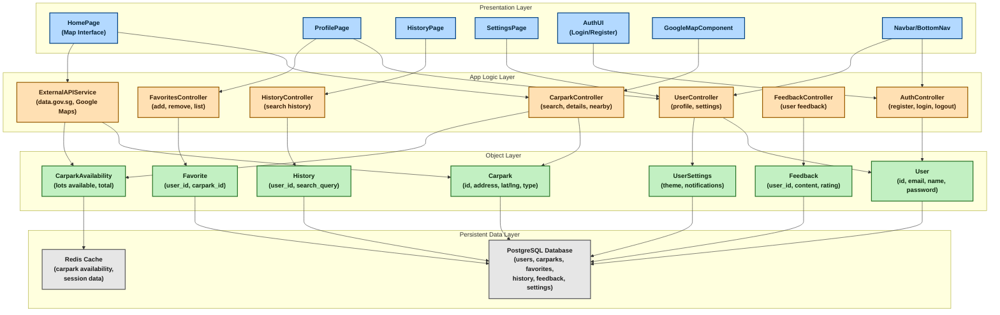

# ParkMate System Architecture Diagram

## Layer Breakdown

### 🎨 Presentation Layer (Frontend - React Components)
- **HomePage**: Main map interface for searching carparks
- **ProfilePage**: User profile management
- **HistoryPage**: Search history display
- **SettingsPage**: User preferences and settings
- **AuthUI**: Login and registration forms
- **GoogleMapComponent**: Interactive map with markers
- **Navbar/BottomNav**: Navigation components

### ⚙️ App Logic Layer (Backend Controllers & Services)
- **AuthController**: Handles user authentication (register, login, logout, token refresh)
- **CarparkController**: Manages carpark search, details, nearby locations
- **UserController**: User profile and settings management
- **FavoritesController**: Add/remove/list favorite carparks
- **HistoryController**: Track and retrieve search history
- **FeedbackController**: Collect and manage user feedback
- **ExternalAPIService**: Integration with data.gov.sg and Google Maps APIs

### 📦 Object Layer (Data Models & Entities)
- **User**: User account information (id, email, name, password_hash)
- **Carpark**: Carpark details (id, address, coordinates, type, amenities)
- **Favorite**: User's saved carparks (user_id, carpark_id)
- **History**: Search history (user_id, search_query, timestamp)
- **Feedback**: User feedback (user_id, content, rating)
- **UserSettings**: User preferences (theme, notifications)
- **CarparkAvailability**: Real-time availability data (lots_available, total_lots)

### 💾 Persistent Data Layer (Databases)
- **PostgreSQL Database**: 
  - Tables: users, carparks, favorites, history, feedback, user_settings
  - Stores permanent data with ACID compliance
- **Redis Cache**: 
  - Caches carpark availability data (5-minute TTL)
  - Session management and temporary data

## Architecture Patterns

1. **Layered Architecture**: Clear separation between presentation, logic, object, and data layers
2. **Repository Pattern**: Data access abstraction in each module
3. **Service Layer Pattern**: Business logic encapsulation in controllers
4. **MVC Pattern**: Model-View-Controller for API endpoints
5. **Caching Strategy**: Redis for frequently accessed data (availability)
6. **RESTful API**: Standard HTTP methods and resource-based routing

## Data Flow Example

1. **User searches for carparks**:
   - HomePage (Presentation) → CarparkController (Logic)
   - CarparkController → Carpark & CarparkAvailability (Objects)
   - Objects → PostgreSQL + Redis (Persistent Layer)
   - Response flows back through the layers

2. **User adds favorite**:
   - ProfilePage (Presentation) → FavoritesController (Logic)
   - FavoritesController → Favorite (Object)
   - Favorite → PostgreSQL (Persistent Layer)

## External Integrations

- **data.gov.sg API**: Real-time carpark availability data
- **Google Maps API**: Geocoding, map display, and navigation
